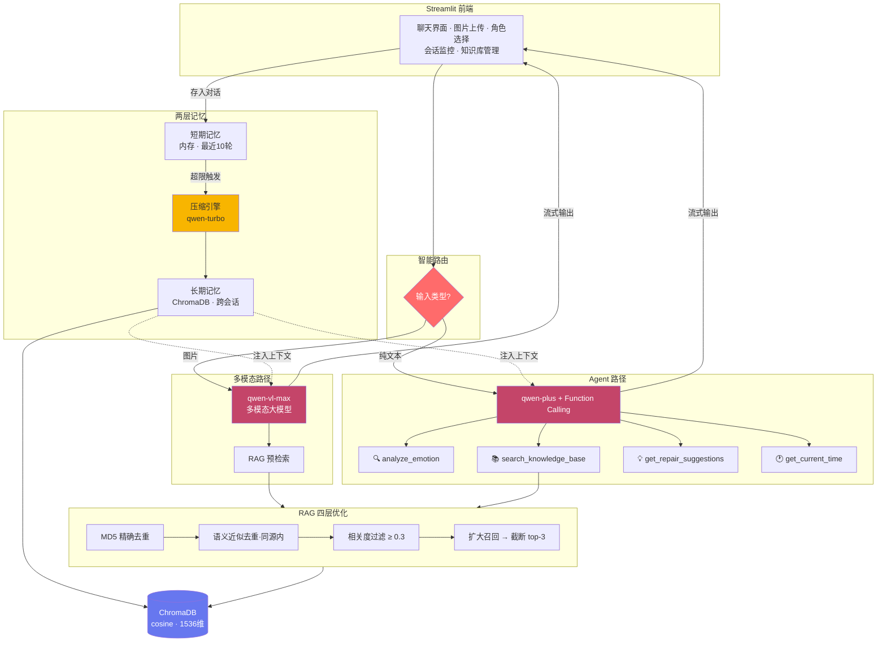

<div align="center">

# 💔❤️ LoveMender — 情绪修复助手

**基于 Agent + RAG + 记忆机制 的多模态情绪修复对话系统**

当你难过、生气、焦虑时，LoveMender 会像一个懂你的朋友一样，先听你说，再帮你找到情绪背后的需求，给出切实可行的修复建议。

[](https://www.python.org/)
[](https://streamlit.io/)
[](https://www.langchain.com/)
[](https://www.trychroma.com/)
[](LICENSE)

**[📖 在线展示页](docs/index.html)** · **[🚀 快速开始](#-快速开始)** · **[📊 评估结果](#-评估结果)** · **[🏗️ 系统架构](#️-系统架构)**

</div>

---

## 项目亮点

```
Recall@3: 100%    MRR: 0.958    RAG 四层优化    两层记忆机制    三级模型路由    Agent 工具调用
```

- **RAG 四层优化**：MD5 去重 → 语义去重 → 相关度过滤 → 扩大召回截断，Recall 100%
- **两层记忆机制**：短期内存缓冲 + 长期摘要向量化，跨会话记忆连续
- **Agent 工具调用**：Function Calling + ReAct，4 个工具自主编排
- **三级模型路由**：按场景选模型，摘要成本比多模态低 80%
- **流式输出**：LLM 回复逐字呈现，会话监控 + 自动提醒
- **评估脚本**：量化验证 RAG 检索质量 + 6 大模块全系统验证

---

## 系统架构



> 完整可视化展示页：打开 [`docs/index.html`](docs/index.html) 查看（含交互式图表）

---

## 核心特性

### 1. RAG 四层优化检索

| 层级 | 技术手段 | 解决的问题 | 关键参数 |
|:----:|---------|-----------|---------|
| 1 | **MD5 精确去重** | 重复上传同一文件时，完全相同的文本块不入库 | `hashlib.md5()` |
| 2 | **语义近似去重**（同源内） | 同一文件中措辞不同但内容重复的段落，只保留一条 | `cosine > 0.95` |
| 3 | **相关度过滤** | 余弦相似度低于阈值的结果不送入 LLM，避免噪声 | `cosine ≥ 0.3` |
| 4 | **扩大召回 + 截断重排** | 先检索 top-20 候选，过滤后取 top-3 | `top-20 → top-3` |

> **关键决策**：语义去重只在同一 `source` 文件内进行，避免不同文件因话题相似被"误杀"。

### 2. 两层记忆机制

| 记忆层 | 存储位置 | 容量 | 生命周期 | 压缩方式 |
|:------:|---------|------|:--------:|---------|
| **短期记忆** | 内存列表 | 最近 10 轮 | 会话内 | — |
| **长期记忆** | ChromaDB 向量库 | 无限 | 跨会话持久 | qwen-turbo → ≤100 字摘要 |

**工作流程**：短期记忆超限 → 提取最早 2 轮对话 → qwen-turbo 压缩为 ≤100 字摘要 → 摘要向量化存入 ChromaDB → 新会话时通过语义检索召回相关历史。

### 3. Agent 工具调用（Function Calling + ReAct）

| 工具 | 功能 | 实现方式 | 延迟 |
|------|------|---------|:----:|
| `analyze_emotion` | 情绪类型 + 强度分析 | 关键词匹配，6 种情绪分类 | 零 |
| `search_knowledge_base` | RAG 知识库检索 | 四层优化向量检索 | ~0.3s |
| `get_repair_suggestions` | 生成修复建议 | 预定义知识库匹配 | 零 |
| `get_current_time` | 时段问候 | 系统时间 + 5 时段问候 | 零 |

基于 LangChain 1.x `create_agent` API（底层 LangGraph），支持流式输出和递归限制。

### 4. 三级模型路由

```
用户输入
  ├─ 包含图片 → qwen-vl-max   （最强 · 最贵）
  ├─ 纯文本   → qwen-plus     （中等 · 支持 Function Calling）
  └─ 摘要压缩 → qwen-turbo    （最便宜 · 摘要成本比 VLM 低 80%）
```

### 5. Token 优化策略

- **上下文截断**：RAG 检索结果超过 2000 字时自动截断
- **回复限制**：LLM 回复最大 1024 token，防止废话
- **模型路由**：摘要用 qwen-turbo（比 qwen-vl-max 便宜约 80%）
- **记忆压缩**：10 轮对话压缩为 ≤100 字摘要，而非全量保留

---

## 项目结构

```
LoveMender/
├── main.py              # Streamlit 主入口（UI + 路由 + 流式输出）
├── config.py            # 全局配置（从 .env 读取，含默认值）
├── model_factory.py     # 三级模型工厂（VLM / 文本 / 摘要 / 嵌入）
├── rag_service.py       # RAG 服务（四层优化：去重 → 过滤 → 重排）
├── memory_manager.py    # 记忆管理器（短期缓冲 + 长期摘要向量化）
├── agent_tools.py       # Agent 工具定义 + Executor 工厂
├── prompt_template.py   # 提示词模板（角色人设 + 公共指令）
├── logger.py            # 日志系统（双输出：控制台 + 文件）
├── utils.py             # 工具函数（图片 base64 编码）
├── eval_rag.py          # RAG 检索质量评估脚本
├── eval_system.py       # 全系统验证脚本（6 大模块）
├── requirements.txt     # 项目依赖
├── .env.example         # 环境变量模板
├── docs/                # 项目展示页（HTML）
│   ├── index.html       # 在线展示页
│   ├── assets/          # 图表脚本
│   └── _shared/         # JS 库 + 字体
├── assets/              # 静态资源（背景图片等）
├── logs/                # 运行日志（自动生成）
└── chroma_rag_db/       # ChromaDB 持久化数据（自动生成）
```

---

## 快速开始

### 环境要求

- Python 3.11+
- 阿里云 DashScope API Key（[申请地址](https://dashscope.console.aliyun.com/apiKey)）

### 安装步骤

```bash
# 1. 克隆仓库
git clone https://github.com/yourusername/LoveMender.git
cd LoveMender

# 2. 创建虚拟环境
python -m venv .venv

# 3. 激活虚拟环境
.venv\Scripts\activate          # Windows
source .venv/bin/activate       # macOS / Linux

# 4. 安装依赖
pip install -r requirements.txt

# 5. 配置环境变量
cp .env.example .env
# 编辑 .env，填入你的 DASHSCOPE_API_KEY

# 6. 启动应用
streamlit run main.py
```

### 使用流程

1. 在侧边栏输入阿里云 API Key
2. （可选）上传情感知识库 `.txt` 文件到 RAG 系统
3. 选择助手角色（温柔体贴男 / 活泼撒娇男 / 理性智慧男 / 沉稳共情男）
4. 输入文字描述或上传聊天截图
5. 点击「开始修复」开始对话
6. 对话轮次达到上限时，点击「新建会话」（长期记忆保留）

---

## 评估结果

### RAG 检索质量评估

使用 `eval_rag.py` 对 12 个测试用例进行评估：

| 指标 | 结果 | 说明 |
|------|:----:|------|
| **Recall@3** | **100%** (12/12) | 所有查询的 top-3 结果中均包含相关内容 |
| **Precision@3** | **75.0%** | top-3 结果中平均 75% 为相关内容 |
| **MRR** | **0.958** | 第一条相关结果的平均倒数排名 |
| **评级** | **A（优秀）** | 基于 Recall + Precision + MRR 综合评定 |

```bash
python eval_rag.py      # RAG 检索质量评估
python eval_system.py   # 全系统验证（6 大模块）
```

### 全系统验证

| 模块 | 状态 | 验证内容 |
|------|:----:|---------|
| 系统健康检查 | ✅ | 配置加载、模块导入、数据库连接、环境变量 |
| RAG 检索质量 | ✅ | Recall、Precision、MRR、平均相似度 |
| 记忆机制 | ✅ | 短期记忆增删、长期记忆检索、cosine 距离 |
| Agent 工具 | ✅ | 4 个工具调用、Agent 创建、指令完整性 |
| 模型路由 | ✅ | 三级模型 + 嵌入模型维度 |
| 缓存性能 | ✅ | 查询耗时 < 1s |

---

## 技术栈

| 类别 | 技术 | 版本 | 用途 |
|------|------|------|------|
| **前端** | Streamlit | 1.61+ | 聊天界面、文件上传、会话监控 |
| **LLM 框架** | LangChain | 1.x | create_agent API、消息构建 |
| **Agent 底层** | LangGraph | — | Function Calling + ReAct 推理循环 |
| **向量数据库** | ChromaDB | 1.5+ | 知识库 + 长期记忆（cosine 距离） |
| **多模态模型** | qwen-vl-max | — | 图片理解 + 文字对话 |
| **文本模型** | qwen-plus | — | Agent 工具调用（Function Calling） |
| **摘要模型** | qwen-turbo | — | 记忆压缩（最低成本） |
| **嵌入模型** | text-embedding-v1 | 1536 维 | 文本向量化 |
| **API 网关** | DashScope | OpenAI 兼容 | 统一模型调用接口 |
| **语言** | Python | 3.11+ | — |

---

## 关键设计决策

### Q1: 为什么用 cosine 距离而不是 L2？

DashScope 的嵌入向量**未做归一化**处理，L2 距离在未归一化向量上表现不稳定。cosine 距离只关注方向不关注模长，对未归一化向量更鲁棒。实测中 L2 导致检索结果排序混乱，切换 cosine 后 Recall 从 ~60% 提升到 100%。

### Q2: 为什么语义去重限定在同一 source 内？

不同文件可能讨论相似话题（如"愤怒管理"和"焦虑缓解"都涉及"深呼吸"），**跨文件去重会误杀合法内容**。限定在同一 `source` 文件内，只去除同文件内的冗余段落。这是实际踩坑后的修复：之前跨文件去重导致第二次导入返回 0 条。

### Q3: 为什么不用 ChromaDB 默认的 embedding function？

ChromaDB 默认使用 **ONNX 模型**做嵌入，首次加载会下载模型文件导致长时间卡顿，且向量维度（384）与 DashScope 嵌入（1536）**不匹配**会导致 C++ 扩展崩溃。解决方案：所有向量通过 DashScope `text-embedding-v1` 预计算后手动传入。

### Q4: 为什么 Agent 路径只走纯文本？

当前通义千问的 **Function Calling 仅在纯文本模型**（qwen-plus）上稳定支持。图片输入走 qwen-vl-max 直接对话 + RAG 预检索，不走 Agent 工具调用。这是模型能力边界的工程化适配。

### Q5: Agent 执行失败时如何降级？

**三级降级策略**：Agent 流式输出 → 异常时回退到直接 LLM 调用（不用工具）→ 仍失败则显示错误。确保用户始终能获得回复，所有异常通过 logger 记录。

---

## License

MIT License - 详见 [LICENSE](LICENSE)
